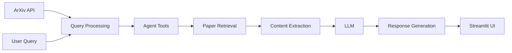

# Chat with ArXiv Research Papers

[](https://www.python.org/downloads/)
[](https://opensource.org/licenses/MIT)

An advanced RAG (Retrieval-Augmented Generation) application that enables interactive conversations with arXiv research papers. Access and explore scientific knowledge using intelligent AI-powered search and question-answering capabilities powered by OpenAI or local Llama models.

## Features

- **ArXiv Integration**: Direct access to arXiv's vast collection of research papers
- **Intelligent Search**: Semantic search through research paper abstracts and content
- **Conversational Interface**: Natural language interactions with research papers
- **RAG-Powered Responses**: Accurate answers based on paper content
- **Real-time Processing**: Instant access to latest research
- **Multiple LLM Support**: Works with OpenAI and local Llama models
- **Paper Discovery**: Find relevant papers based on research interests
- **Content Summarization**: Get concise summaries of complex research papers

## Architecture



## Prerequisites

- Python 3.8 or higher
- OpenAI API key (for cloud models) OR
- Ollama running locally (for Llama models)

## Installation

1. Clone the repository:
```bash
git clone https://github.com/rchhabra13/01-ML-Projects-Collection.git
cd chat_with_research_papers
```

2. Create and activate virtual environment:
```bash
python -m venv venv
source venv/bin/activate  # On Windows: venv\Scripts\activate
```

3. Install dependencies:
```bash
pip install -r requirements.txt
```

4. For OpenAI models (chat_arxiv.py):
```bash
export OPENAI_API_KEY="your-api-key-here"
streamlit run chat_arxiv.py
```

5. For Llama 3.1 local (chat_arxiv_llama3.py):
```bash
# First, start Ollama
ollama run llama3.1:8b

# In another terminal:
streamlit run chat_arxiv_llama3.py
```

6. Access the application at `http://localhost:8501`

## Usage

### Search and Query
1. Run the appropriate application (see Installation)
2. Enter your OpenAI API key (for cloud models)
3. Enter a search query related to your research interests
4. Get instant, context-aware answers with paper references

### Example Queries
- "What are the latest developments in quantum computing?"
- "Find papers about machine learning in healthcare."
- "Summarize the main findings on neural networks."
- "What are the key trends in computer vision research?"
- "Compare different approaches to natural language processing."

## Technical Stack

- **Framework**: Agno AI Agent Framework
- **LLM Options**:
  - OpenAI GPT-4o (cloud)
  - Llama 3.1 (local via Ollama)
- **ArXiv API**: Direct integration with arXiv API
- **UI**: Streamlit for user interface
- **Tools**: Agno ArXiv tools for paper search and retrieval

## Configuration

### Environment Variables (.env)
```bash
OPENAI_API_KEY=sk-your-api-key-here
OLLAMA_BASE_URL=http://localhost:11434
OLLAMA_MODEL=llama3.1:8b
```

### Model Selection

Edit the relevant file to customize:
- **chat_arxiv.py**: Uses OpenAI GPT-4o
- **chat_arxiv_llama3.py**: Uses Llama 3.1 with Ollama locally

## Supported Research Fields

ArXiv covers all major research categories including:
- Computer Science and AI
- Physics (all sub-fields)
- Mathematics
- Biology and Medicine
- Engineering and Technology
- Economics and Finance
- And many more

## Troubleshooting

### Ollama Connection Issues
```bash
# Check if Ollama is running
curl http://localhost:11434/api/tags

# Pull a model
ollama pull llama3.1:8b
```

### API Key Errors
- Verify your OpenAI API key is valid
- Check that the key has sufficient quota
- Ensure no extra whitespace in the `.env` file

### No Results
- Ensure you have internet connection for ArXiv access
- Try more specific search terms
- Check ArXiv API rate limits

## Performance Features

- **Fast Search**: Optimized arXiv API integration
- **Intelligent Caching**: Reduces redundant API calls
- **Error Handling**: Robust error handling and fallback mechanisms
- **Rate Limiting**: Respects arXiv API rate limits

## Security & Privacy

- **API Security**: Secure API key management
- **Data Privacy**: No permanent storage of paper content
- **Rate Limiting**: Respects arXiv API rate limits
- **Privacy Compliance**: Follows data privacy best practices

## Contributing

Contributions are welcome! Please:
1. Fork the repository
2. Create a feature branch (`git checkout -b feature/improvement`)
3. Make your changes
4. Add logging and error handling
5. Submit a pull request

## License

This project is licensed under the MIT License - see the [LICENSE](LICENSE) file for details.

## Support

For issues and questions:
- Create an issue on GitHub
- Check existing documentation
- Review the FAQ section

## Acknowledgments

- OpenAI for the language models
- ArXiv for providing access to research papers
- Agno framework for agent orchestration
- Streamlit for the user interface
- The research community

---

**Author**: Rishi Chhabra ([@rchhabra13](https://github.com/rchhabra13))

**Note**: This application is designed for educational and research purposes. Always respect copyright and citation requirements when using research papers.
